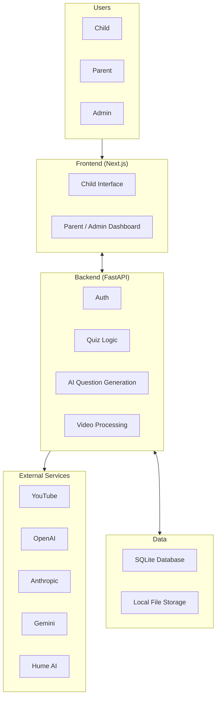

# System Block Diagram

## Component Descriptions

**Frontend** - A Next.js web application with two distinct interfaces. The child interface handles video playback, voice-based quiz interactions, companion character display, and real-time progress updates. The parent and admin dashboard handles account management, interaction mode configuration, video setup, and progress reports.

**Backend** - A FastAPI server that manages authentication, quiz logic, answer evaluation, AI question generation, video processing, and progress tracking. It exposes REST and WebSocket endpoints consumed by the frontend.

**Database and Storage** - SQLite stores user accounts, quiz results, and video metadata. The local file system holds downloaded videos, extracted frames, and generated question files.

**External Services**
- **YouTube** - Source of video content, downloaded and processed for use in activities.
- **OpenAI** - Used for quiz question generation and child response evaluation.
- **Anthropic** - Used as an alternative AI provider for question generation.
- **Gemini** - Used as an alternative AI provider for question generation.
- **Hume AI** - Provides expressive voices for the companion characters.
