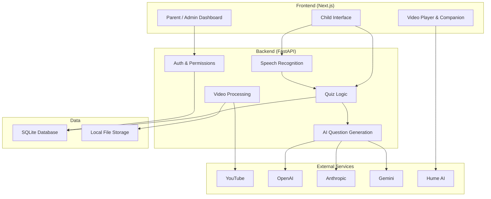

# System Block Diagram

## Component Descriptions

**Frontend (Next.js)**
- **Child Interface** - The screen the child uses to log in, pick their companion, and interact with quizzes. Captures the child's voice answer through the browser microphone and sends it to the backend.
- **Video Player & Companion** - Plays the YouTube video and displays the chosen companion character alongside it. The companion reacts and speaks using a voice provided by Hume AI.
- **Parent / Admin Dashboard** - Lets parents set the interaction mode (Flexible, Strict, or Passive), manage their child's profile, review progress reports, and manage video activities.

**Backend (FastAPI)**
- **Auth & Permissions** - Handles access code login for children and parents, and role-based access for admins.
- **Quiz Logic** - Controls when questions appear during the video, enforces the interaction mode rules (pause, rewind, or continue), and records results.
- **Speech Recognition** - Receives the child's recorded voice answer from the frontend, transcribes it to text, and passes it to Quiz Logic for evaluation.
- **AI Question Generation** - Sends video frames and transcripts to an AI provider to generate quiz questions. Supports OpenAI, Anthropic, and Gemini.
- **Video Processing** - Downloads videos from YouTube and prepares them for use in activities.

**External Services**
- **YouTube** - Source of all video content.
- **OpenAI / Anthropic / Gemini** - AI providers used to generate quiz questions from video content and evaluate child responses.
- **Hume AI** - Provides the expressive companion voices that respond to the child during the quiz.

**Data**
- **SQLite Database** - Stores user accounts, quiz results, progress history, and video metadata.
- **Local File Storage** - Holds downloaded videos, extracted video frames, and generated question files.

## Voice Interaction Flow

1. A question appears and the video pauses (in Strict or Flexible mode).
2. The child speaks their answer aloud into the device microphone.
3. The browser captures the audio and sends it to the backend.
4. The backend transcribes the audio to text using Speech Recognition.
5. Quiz Logic evaluates the transcribed answer.
6. The result is sent back to the frontend - the companion reacts with spoken feedback via Hume AI and the video either continues or rewinds depending on the interaction mode.
