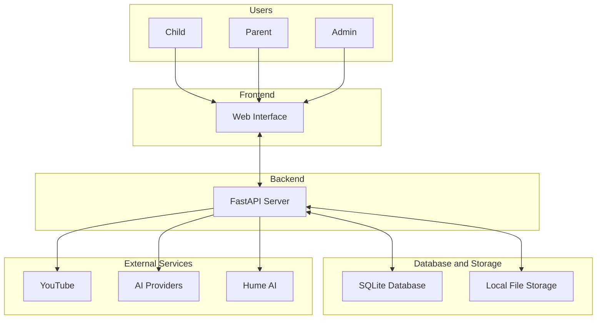

# System Block Diagram

## Component Descriptions

**Frontend** - A Next.js web application that serves separate interfaces for children, parents, and admins. It handles video playback, voice-based quiz interactions, companion character display, and real-time progress updates over WebSockets.

**Backend** - A FastAPI server that manages authentication, quiz logic, answer evaluation, AI question generation, video processing, and progress tracking. It exposes REST and WebSocket endpoints consumed by the frontend.

**Database and Storage** - SQLite stores user accounts, quiz results, and video metadata. The local file system holds downloaded videos, extracted frames, and generated question files.

**External Services**
- **YouTube** - Source of video content, accessed via the YouTube API and yt-dlp for downloading.
- **AI Providers (OpenAI, Anthropic, Gemini)** - Used to generate quiz questions from video frames and transcripts, and to evaluate child responses.
- **Hume AI** - Provides expressive voices for the companion characters.
