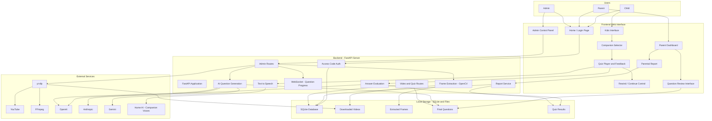

# System Block Diagram

```mermaid
flowchart TD

  subgraph USERS["Users"]
    Child["Child"]
    Parent["Parent"]
    Admin["Admin"]
  end

  subgraph FE["Frontend Web Interface"]
    HomeUI["Home / Login Page"]
    KidsUI["Kids Interface"]
    CompanionUI["Companion Selector"]
    QuizUI["Quiz Player and Feedback"]
    RewindUI["Rewind / Continue Control"]
    ParentUI["Parent Dashboard"]
    ReportUI["Parental Report"]
    AdminUI["Admin Control Panel"]
    ReviewUI["Question Review Interface"]
  end

  subgraph BE["Backend - FastAPI Server"]
    API["FastAPI Application"]
    AuthService["Access Code Auth"]
    AdminRoutes["Admin Routes"]
    KidsRoutes["Video and Quiz Routes"]
    ReportService["Report Service"]
    WS["WebSocket - Question Progress"]
    AnswerCheck["Answer Evaluation"]
    TTS["Text to Speech"]
    AIGen["AI Question Generation"]
    FrameExt["Frame Extraction - OpenCV"]
  end

  subgraph EXT["External Services"]
    YTDLP["yt-dlp"]
    YouTube["YouTube"]
    FFmpeg["FFmpeg"]
    OpenAI["OpenAI"]
    Anthropic["Anthropic"]
    Gemini["Gemini"]
    Hume["Hume AI - Companion Voices"]
  end

  subgraph STORE["Local Storage - SQLite and Files"]
    DB["SQLite Database"]
    Videos["Downloaded Videos"]
    Frames["Extracted Frames"]
    Questions["Final Questions"]
    Results["Quiz Results"]
  end

  Child --> HomeUI
  Parent --> HomeUI
  Admin --> HomeUI

  HomeUI --> AuthService
  AuthService --> DB

  Child --> KidsUI
  KidsUI --> CompanionUI
  CompanionUI --> QuizUI
  QuizUI --> AnswerCheck
  QuizUI --> RewindUI
  QuizUI --> TTS
  TTS --> Hume

  AnswerCheck --> Results
  AnswerCheck --> OpenAI

  Parent --> ParentUI
  ParentUI --> ReviewUI
  ParentUI --> ReportUI
  ReportUI --> ReportService
  ReportService --> DB
  ReportService --> Results

  ReviewUI --> Questions

  Admin --> AdminUI
  AdminUI --> AdminRoutes
  AdminRoutes --> YTDLP
  AdminRoutes --> FrameExt
  AdminRoutes --> AIGen
  AdminRoutes --> WS

  YTDLP --> YouTube
  YTDLP --> FFmpeg
  YTDLP --> Videos

  FrameExt --> Videos
  FrameExt --> Frames

  AIGen --> OpenAI
  AIGen --> Anthropic
  AIGen --> Gemini
  AIGen --> Questions

  KidsRoutes --> Questions
  KidsRoutes --> DB
```
