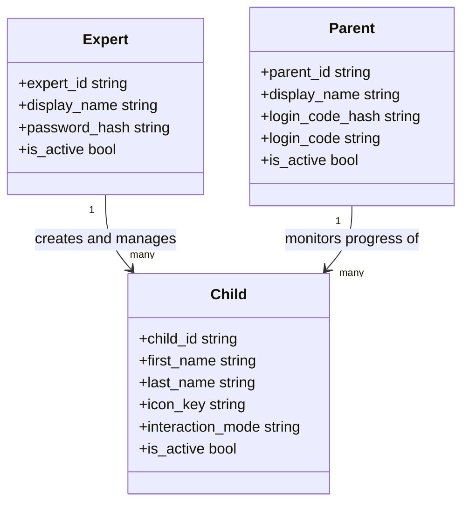
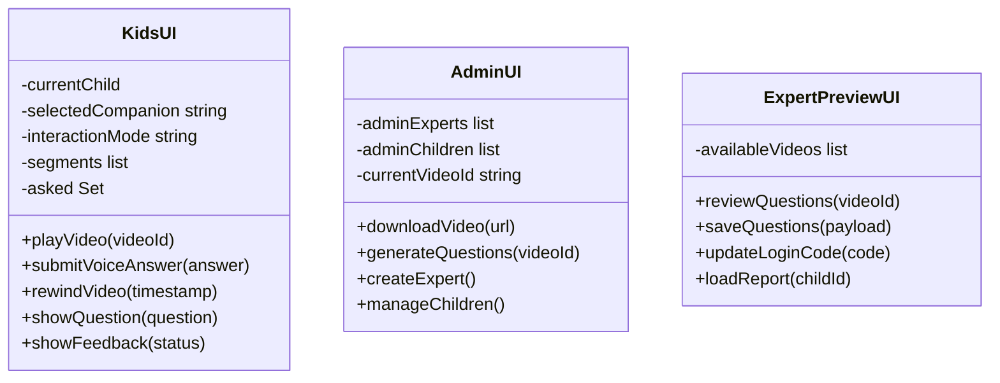

# Class Diagrams

## Backend - User Roles

All three user types are separate tables in the database. `Expert` is the admin role that manages videos and children. `Parent` logs in with an access code to view reports. `Child` is the learner profile linked to both.

---

## Backend - Services

```mermaid
classDiagram
    class ExpertAuthService {
        +authenticate_expert(expert_id, password)
        +create_expert(expert_id, display_name, password)
        +update_expert(expert_id, fields)
        +add_video_assignment(video_id, expert_id)
        +can_expert_access_video(expert_id, video_id)
    }
    class ChildrenService {
        +create_child(expert_id, first_name, last_name, icon_key, interaction_mode)
        +get_child(child_id)
        +list_children(expert_id)
        +update_child(child_id, fields)
        +deactivate_child(child_id)
    }
    class QuizScoringService {
        +save_quiz_result(child_id, video_id, score_data)
        +get_child_scores(child_id)
    }
    class ReportService {
        +get_child_report(child_id)
        +get_child_report_scoped(child_id, video_id, mode)
    }
    class QuestionGenerationService {
        +generate_questions(transcript, frames)
        +build_segments(duration, interval)
        +validate_json(response)
    }
    class PersonalizeQuizService {
        +generate_persona_variants(questions, best_question)
    }
    class ExpertReviewService {
        +get_expert_questions_payload(video_id)
        +save_final_questions_payload(video_id, payload)
    }
    class DownloadService {
        +download_youtube(url)
    }
    class FrameService {
        +extract_frames_per_second_for_video(video_id)
    }
    class VideoFiles {
        +find_primary_video_file(video_dir)
        +list_question_json_files()
    }
    class AIClients {
        +get_openai_client()
        +get_anthropic_client()
        +get_gemini_configured()
    }
    class SQLiteStore {
        +init_db()
        +get_conn()
    }
    class YouTube {
        <<external>>
    }

    ChildrenService --> ExpertAuthService : uses normalize_expert_id
    ExpertAuthService --> SQLiteStore : reads/writes
    ChildrenService --> SQLiteStore : reads/writes
    QuestionGenerationService --> AIClients : gets AI clients
    ExpertReviewService --> QuestionGenerationService : uses helpers
    ExpertReviewService --> VideoFiles : finds video files
    DownloadService --> VideoFiles : finds video file
    FrameService --> VideoFiles : finds video file
    DownloadService --> YouTube : downloads from
```

---

## Frontend - Interfaces

