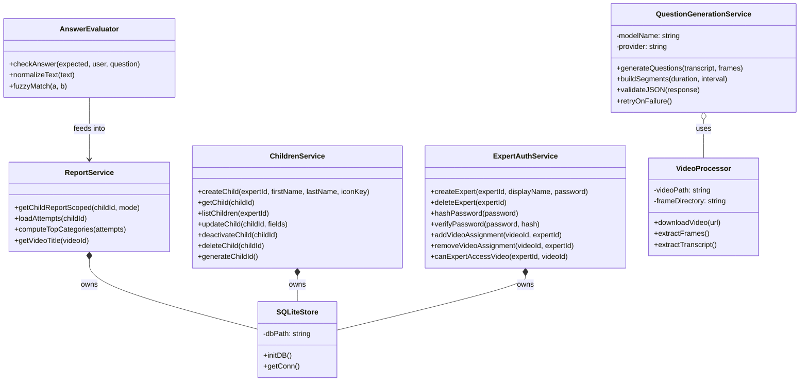
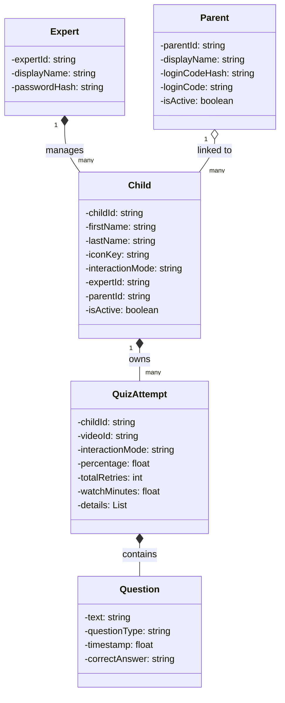
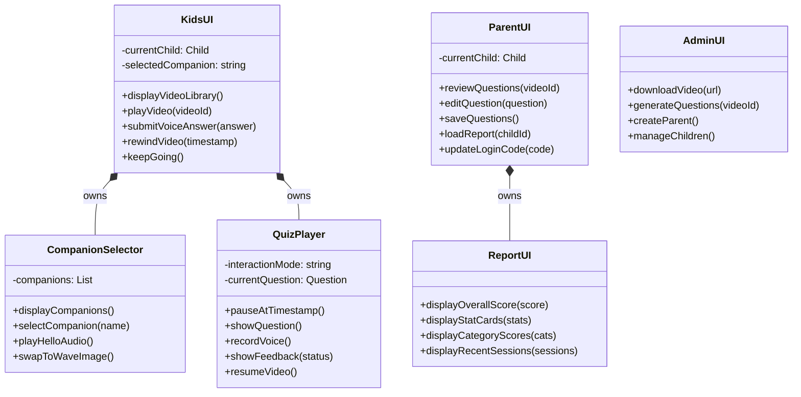
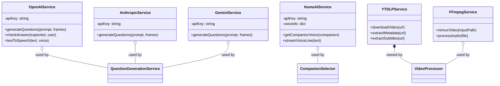

# Class Diagrams

## Backend Services

The backend is organized into focused service modules. `ChildrenService` and `ExpertAuthService` handle all user and access management. `ReportService` computes per-child progress reports from quiz result files. `AnswerEvaluator` scores voice answers using fuzzy matching and text normalization.

---

## Data Models

---

## Frontend Interfaces

The frontend is split by user role. `KidsUI` handles the child experience including companion selection and quiz playback. `ParentUI` covers question review and report viewing. `AdminUI` manages video processing and account management.

---

## External Services

All three AI providers (OpenAI, Anthropic, Gemini) are supported for question generation. Hume AI powers the companion character voices. yt-dlp and FFmpeg handle video downloading and processing.
