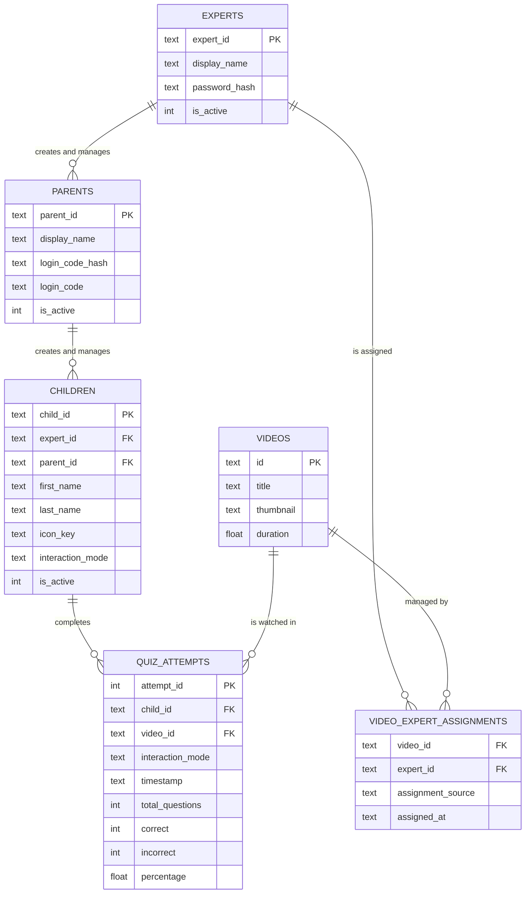

# ERD Diagram

**How to read this:** Each box is a database table. Lines show how the tables connect. `||` means "exactly one" and `o{` means "zero or more."

**How this program works:**
- An **Expert** (admin) downloads videos and creates parent accounts. They can view both parents and children for management but cannot access the child interface.
- A **Parent** is created by the admin and creates their children's profiles. They log in to view progress reports and configure their child's interaction mode.
- A **Child** is the learner - they belong to one expert and optionally one parent.
- **Videos** are YouTube videos the expert has downloaded into the system.
- **Video Expert Assignments** tracks which expert manages which video.
- **Quiz Attempts** is a record saved every time a child finishes a quiz on a video.

