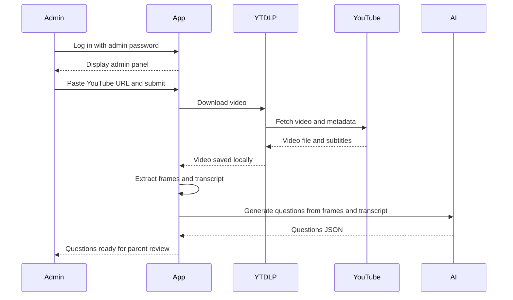
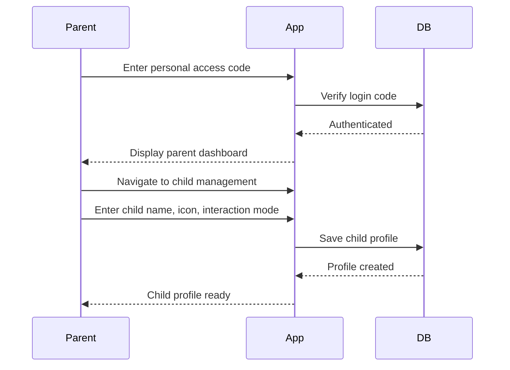
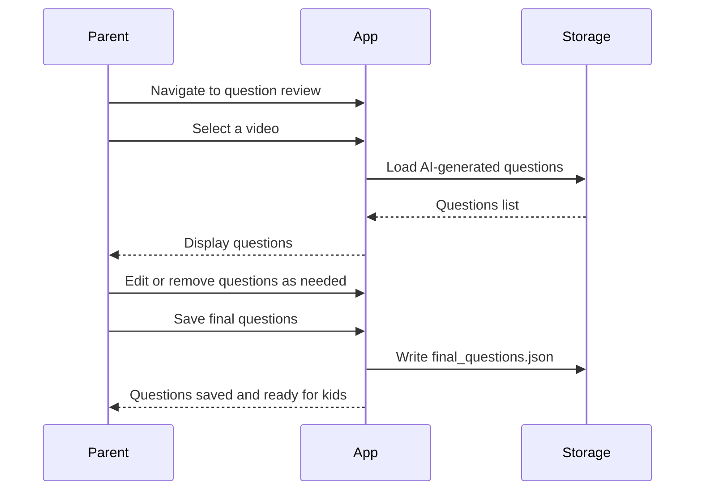
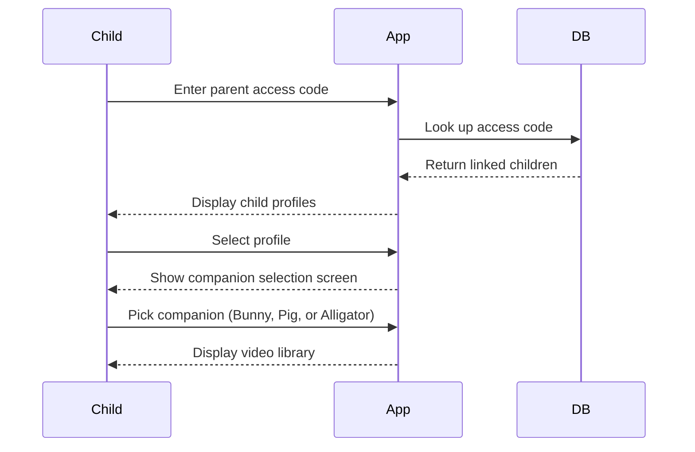
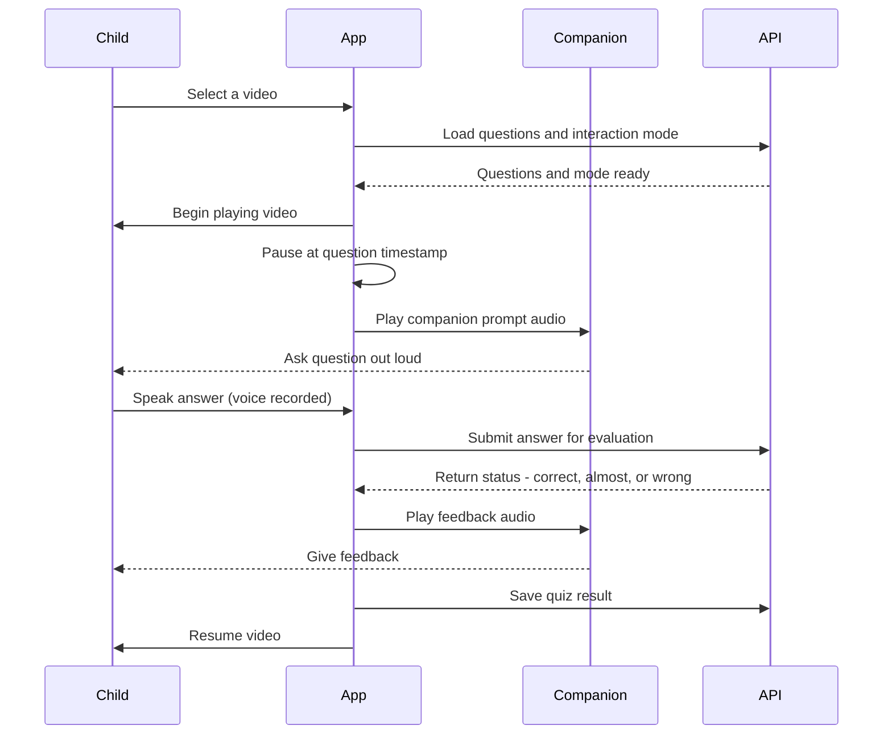
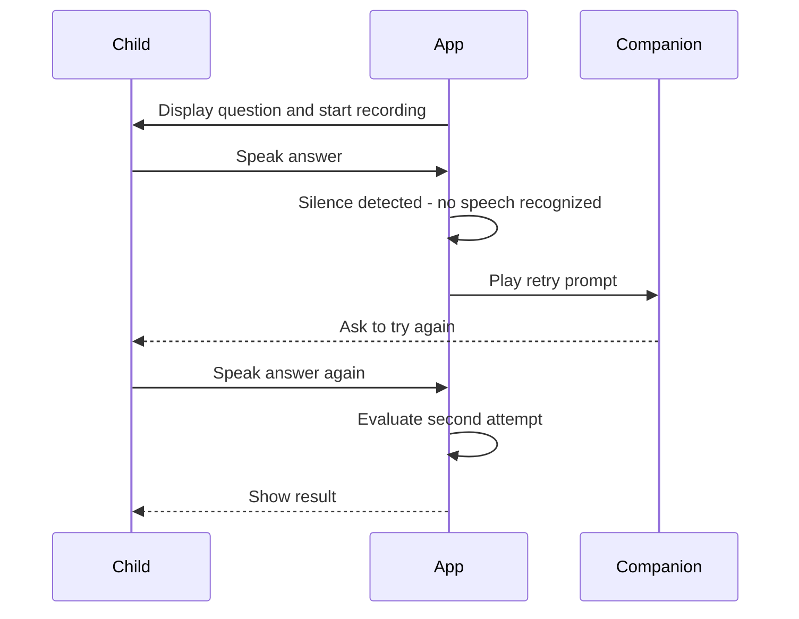
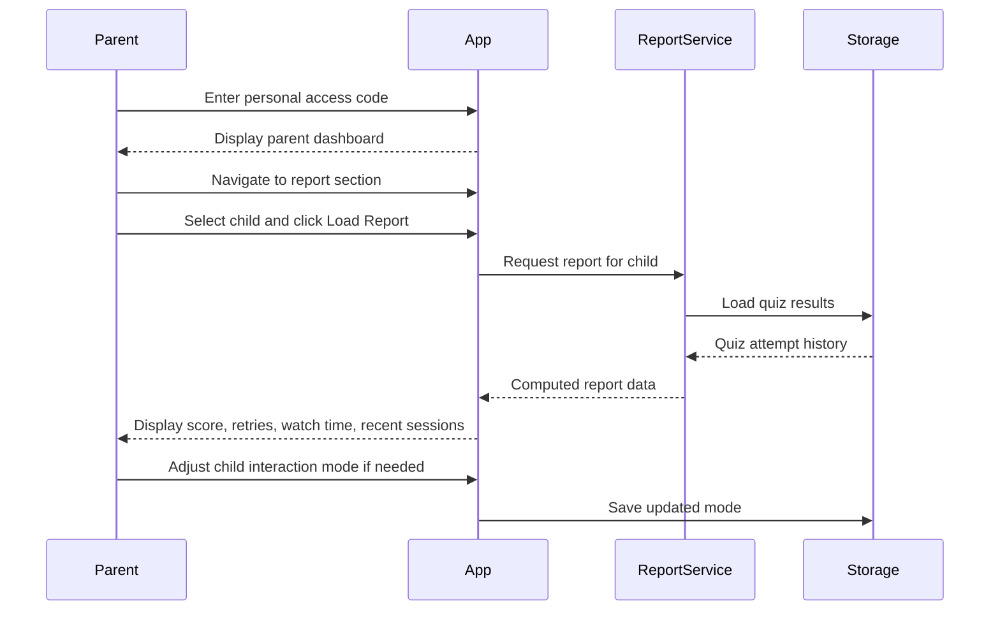

# Sequence Diagrams

## Use Case 1 - Admin downloads a video and generates questions

---

## Use Case 2 - Parent sets up their child's profile

---

## Use Case 3 - Parent reviews and approves quiz questions

---

## Use Case 4 - Child logs in and picks a companion

---

## Use Case 5 - Child watches a video and answers quiz questions

---

## Use Case 6 - Child's voice is not recognized

---

## Use Case 7 - Parent checks their child's report

